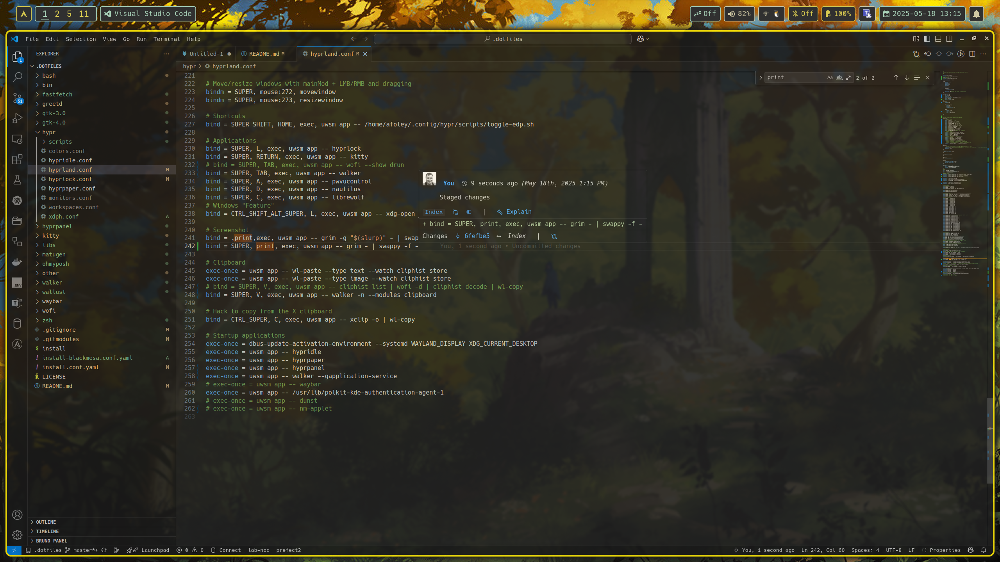
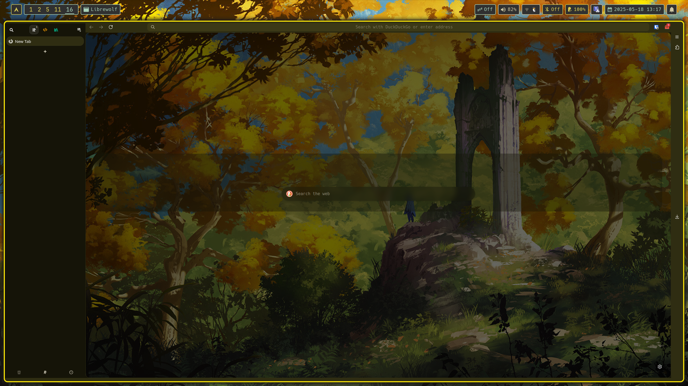

# dotfiles

This is my personal collection of dot files used throughout mutliple different machines.

## Preview

<table>
  <tr>
    <td></td>
    <td></td>
  </tr>
  <tr>
    <td></td>
    <td></td>
  </tr>
</table>


## Applications

|            |                   |
|------------|-------------------|
| Compositor | Hyprland          |
| Launcher   | Walker            |
| Screenlock | Hyprlock          |
| Status Bar | Hyprpanel         |
| Terminal   | Kitty             |
| Prompt     | oh-my-posh        |
| Icons      | candy-icons       |
| Cursor     | Bibata-Modern-Ice |
| Browser    | Librewolf         |
| Colours    | Matugen Templates |

## Install

Clone the repo and its submodules, then install links.
The install **will not** override any configs by default.

```sh
git clone https://github.com/aaronfoley/dotfiles.git && \
cd dotfiles && ./install
```

If errors occur due to existing files, move them and try again.
Per machine configuration will be run based on current hostname.

## Update

Pull the latest from git and re-run the installer:

```sh
git pull && ./install
```

## Arch Linux Packages

List of packages that are required to be installed

```
# Dependencies
git
ags-hyprpanel-git
bibata-cursor-theme
candy-icons-git
hyprcursor
hypridle
hyprland
hyprland-qtutils
hyprlock
hyprpaper
matugen-bin
oh-my-posh
ttf-hack-nerd
python-pywalfox-librewolf
sweet-gtk-theme
wallust
xdg-desktop-portal-gtk
xdg-desktop-portal-hyprland
zsh

# Login Manager
cage
greetd
greetd-regreet

# Applications
kitty
cliphist
fastfetch
network-manager-applet
nm-connection-editor
nautilus
librewolf-bin
pwvucontrol
seahorse
grim
nwg-displays
nwg-look
seahorse
slurp
swappy
walker
xclip
```
